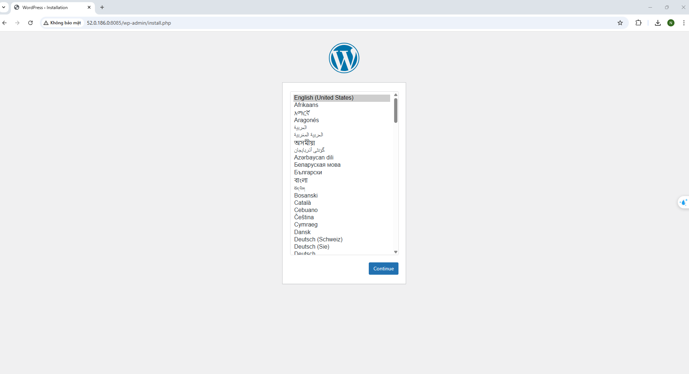
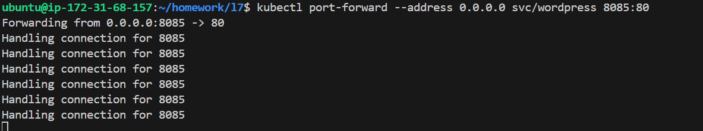

 Assignment 1: Deploy WordPress Application to K8s
 - Create k8s yaml file to run Wordpress Application. Please note that Wordpress require MySql as the database 
 - Use K8s pod, service, configmap, seccret for provisioning wordpress and MySql 
 - At the end, use port-forwarding to access the service

----

## Tư duy làm bài

Triển khai 2 Pod bằng file YAML  
- 1 file triển khai pod chứa container **WordPress**  
- 1 file triển khai pod chứa container **MySQL**  
- Hai Pod này muốn nói chuyện được với nhau phải sử dụng qua **Service: ClusterIP**  

Các **environment** trong **ConfigMap** và **Secret** để WordPress và MySQL kết nối với nhau gồm:

- Tài khoản user  
- Mật khẩu tài khoản user  
- Mật khẩu tài khoản root  
- Tên database WordPress sẽ dùng  
- Tên host: Service name của MySQL (Khi container WordPress khởi động, nó sẽ kết nối đến MySQL Service trong cluster có tên nào đó)

---

### ⇒ Từ đó suy ra ta cần ít nhất là 6 files manifest :

- Configmap.yaml : `wordpress-configmap.yaml` 
- Secret.yaml  : `mysql-secret.yaml`
- ServiceWordPress.yam : `wordpress-service.yaml`
- PodWordPress.yaml  : `wordpress-pod.yaml`
- ServiceMySQL.yaml : `mysql-service.yaml`
- PodMySQL.yaml : `mysql-pod.yaml`

---
## Nội dung các file manifest

## 1. `mysql-secret.yaml`
Dùng lệnh sau để mã hóa mật khẩu theo base 64
```sh
echo -n 'password' | base64
```
```yaml
apiVersion: v1
kind: Secret
metadata:
  name: mysql-secret  # Tên của Secret
type: Opaque  # Loại Secret
data:
  mysql-root-password: MTIz     # "password"
  mysql-user-password: MTIz     # "password"
  ```
## 2. `mysql-service.yaml`

```yaml
apiVersion: v1
kind: Service
metadata:
  name: mysql # Tên service là mysql từ đặt
spec:
  selector:
    app: mysql # Chọn lable có tên mysql
  ports:
    - port: 3306 #Port này do mình mở có thể để tùy chỉnh
      targetPort: 3306 # Port này là nơi mặc định của MySQL trên Dockerhub
  clusterIP: None  # Headless service để DNS nội bộ hoạt động ổn định

```
## 3. `mysql-pod.yaml`

```yaml
apiVersion: v1
kind: Pod
metadata:
  name: mysql-pod # Tên của Pod
  labels:
    app: mysql  # Nhãn để nhận diện Pod
spec:
  containers:
    - name: mysql   # Tên container tự đặt
      image: mysql:8.0  # Sử dụng phiên bản MySQL 8.0
      ports:
        - containerPort: 3306 # Cổng mặc định của MySQL
      env:
        - name: MYSQL_ROOT_PASSWORD
          valueFrom:
            secretKeyRef:
              name: mysql-secret  # Tên của Secret chứa mật khẩu root
              key: mysql-root-password  # Khóa trong Secret
        - name: MYSQL_DATABASE  # Tên cơ sở dữ liệu khởi tạo
          value: wordpress  # Tạo cơ sở dữ liệu có tên 'wordpress'
        - name: MYSQL_USER # Tên người dùng mới
          value: wpuser # Tạo người dùng 'wpuser'
        - name: MYSQL_PASSWORD
          valueFrom:
            secretKeyRef:
              name: mysql-secret  # Tên của Secret chứa mật khẩu người dùng
              key: mysql-user-password  # Khóa trong Secret
      volumeMounts:
        - name: mysql-storage # Gắn volume vào thư mục dữ liệu của MySQL
          mountPath: /var/lib/mysql
  volumes:
    - name: mysql-storage   # Sử dụng emptyDir cho mục đích demo dữ liệu sẽ bị mất khi Pod bị xóa
      emptyDir: {}


```
## 4. `wordpress-configmap.yaml`

```yaml
apiVersion: v1
kind: Secret
metadata:
  name: mysql-secret  # Tên của Secret
type: Opaque  # Loại Secret
data:
  mysql-root-password: MTIz     # "password"
  mysql-user-password: MTIz     # "password"
```
## 5. `wordpress-service.yaml`

``` yaml
apiVersion: v1
kind: Service
metadata:
  name: wordpress
spec:
  selector:
    app: wordpress
  ports:
    - port: 80
      targetPort: 80
  type: ClusterIP
```
## 6.`wordpress-pod.yaml`

```yaml
apiVersion: v1
kind: Pod
metadata:
  name: wordpress-pod
  labels:
    app: wordpress
spec:
  containers:
    - name: wordpress
      image: wordpress:6.2
      ports:
        - containerPort: 80
      envFrom:
        - configMapRef:
            name: wordpress-config
      env:
        - name: WORDPRESS_DB_PASSWORD
          valueFrom:
            secretKeyRef:
              name: mysql-secret
              key: mysql-user-password

```
Chay command
```sh
kubectl apply -f mysql-secret.yaml
kubectl apply -f mysql-service.yaml
kubectl apply -f mysql-pod.yaml
kubectl apply -f wordpress-configmap.yaml
kubectl apply -f wordpress-service.yaml
kubectl apply -f wordpress-pod.yaml
```
```sh
 kubectl port-forward --address 0.0.0.0 svc/wordpress 8085:80
```



